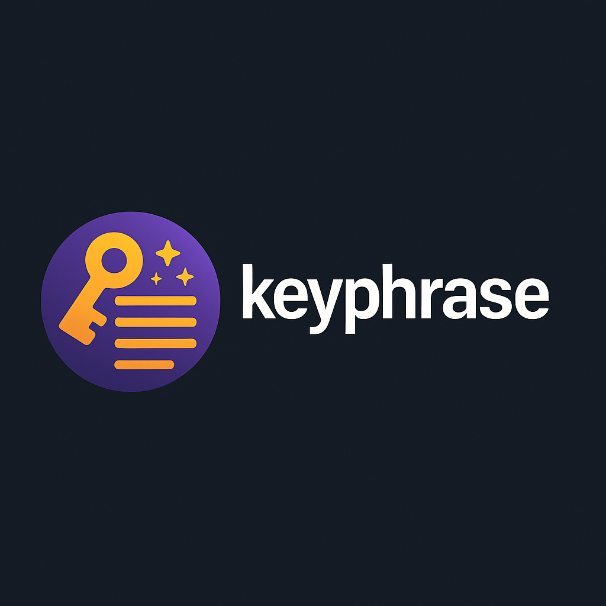

<p align="center">
  
</p>

# 🔑 keyphrase

**Mnemonic (word list) ↔ private key encoder/decoder in Go**

---

## ✨ Features

- Encode a hex-encoded private key into a custom word-based mnemonic
- Decode mnemonic word lists back to the original key
- Works with any word list (base64-embedded or file-based)
- Built in Go with a simple CLI interface
- Optional checksum support (planned)

---

## 🚀 Usage

### 🔧 Build

```bash
go build -o keyphrase main.go
```

### 🔐 Encode a private key
```bash
./keyphrase encode
```
You will be prompted to enter a 32-byte (64-character) hex key.

### 🔐 Decode a word list
```bash
./keyphrase decode
```
Paste the mnemonic words (space-separated) to get the original private key.

